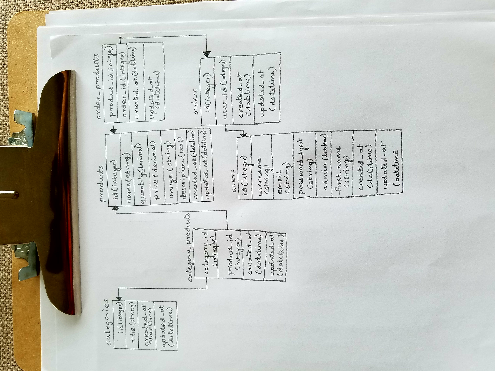

## Grocery Shop

### App description and Features

1. Authentication system, users/customers can sign up, edit their profile, log in/out
2. Admin Functionality implementation.
3. Customers can see a complete list of products available.
    - Product details include product image, product description and product price.
    - Buttons for editing/deleting a product is only accessible to Admins.
    - The edit/delete buttons show up only for admins, hidden for other customers. (This feature is not implemented. I just have buttons as placeholders). 
4. Customers once logged in can see all the orders placed by them. 
    - List of orders include Order ID, Order status, Order placed, Order Total, all products in that order.
5. Admins can see a breakdown of products sold by quantity per day/week/month.
    - This option is only available to admins.
    - Ability to export the results to CSV.
6. Mobile friendly with styling responsive.
7. Twitter bootstrap for styling.

### Schema



### Spinning Up

```ruby
# Install dependencies
$ bundle install  

# Create, migrate and seed the database
$ be rails db:create
$ be rails db:migrate
$ be rails db:seed # used faker gem for seeding products and orders

# Start the rails server
$ rails s

```

### Associations and Validations
  
  - Many to many associations between categories and products
  - Many to many associations between orders and products
  - One to many associations between users and orders
  - Added validations for categories, products, orders and users.

### SQL Query to return the products for a customer
  - Refer `sql_queries.md` file in the root directory of the project

### Additional questions

###### We want to give customers the ability to create lists of products for a one-click ordering of bulk items. How would you design the tables, what are the pros and cons of your approach?

- In order to give customers the ability to create lists of products, we need a `carts` table. 
- `cart` can have many `products` and the `product` can belong to many `carts`. So there is a many to many relationship between `products` and `carts`. So we need a join table called `cart_items` between `products` and `carts` 
- `cart_items` will have the fields -> `product_id`, `quantity` and `cart_id`.

- A customer should be able to add products to the cart and retain the products in the cart even after leaving the site. 
- So we need to retrieve the current cart information based on the `cart_id` stored in session or create one if it does not exist and store in the session.

- Customer should be able to browse the list of products and click the `Add to Cart` button to add a product to the current cart.
  - A few things to keep in mind here:
     - If the product already exists in the cart, we need to simply update the quantity and save the results.
     - Else add a new product to the `cart` by creating a new `CartItem` instance.

- Once the customer is done adding all the items to the cart, they can checkout and place their order
  - At this point we create a new `order` and add all the products in the `cart` to that `order`.
  - This way the `order` along with the `products` shows up in the customer's `My Orders` tab.

#### If you knew the exact inventory of stores, and when facing a high traffic and limited supply of a particular item, how do you distribute the inventory among customers checking out?
  - Handle checkouts on a first cum first serve basis!


